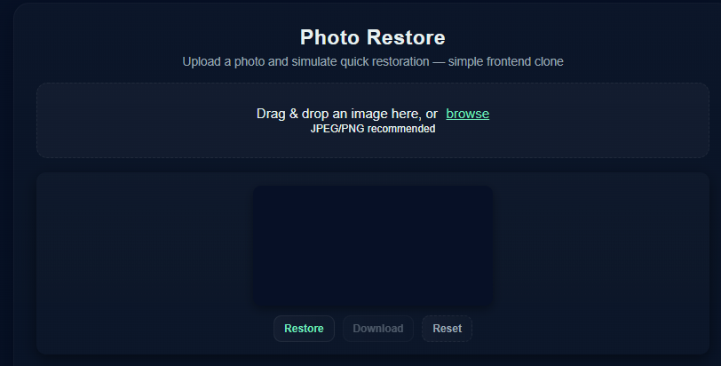

# Photo Restore — Simple Frontend

A minimal, client-side of a photo restoration UI. This project provides three files only:

## Features
- Drag & drop or browse to load an image (client-side only).
- Preview on a canvas.
- "Restore" button triggers a simulated processing pipeline (sharpen + subtle adjustments).
- Download the processed image as PNG.
- No server or external dependencies.

## Notes & customization ideas
- This is a **simulation**: it runs entirely in the browser and does not upload images anywhere.
- To replace the simulated processing with a real restoration backend, add a server endpoint to accept the image and return a processed image (CORS & privacy considerations apply).
- Improve UI: add progress indicator details, more restoration presets, or a history stack to compare before/after.

## License
Use freely for learning or demos. If you publish a public site, consider attributing or noting that this is a simple demo.

## 📸 Screenshot

---

## 🌐 Live Demo
[👉 Click here to use the photo-restore](https://xyzvikram.github.io/photo-restore/)

---
123456789